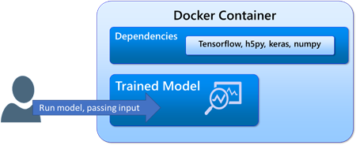
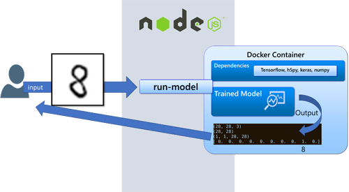

# Simplifying Delivery and Usage of ML Models

Simplifying the deployment of machine learning models is an important goal. Data scientists are skilled at building machine learning model, not at getting the model into production to ensure users can leverage it to make predictions. Sure, they can use their Jupyter nodebooks to make predictions and see the result. 

What data scientists need is an easy way create a standalone application that can make ad hoc predictions with models they create.

## CraneML to the rescue
Containerizing and Operationalizing ML models is hard. Once you've created the next cancer-predicting AI model, how do you expose it as a service that can be consumed by other applications for their benefit?
CraneML was created to help solve this issue.

## Data Science Workflow
Below is the familiar workflow to a data scientist. It is included here for completeness.

- **Obtain Data and Build Training Model** – Data is used to build a model that will be used to make predictions.
- **Make A Prediction** – Use input and the model to make a prediction
- **Results** – Review results, improve model as needed

Making the prediction model available to others
Once a model is developed, the important next step is make that model available to other users. CraneMl consists of the following technologies and processes that will jumpstart the effort of making a machine learning model easy to use.

- **Docker Containers** – Used to provide an enivironment in which to run the prediction model. It contains all the dependencies that model needs to execute to make the prediction.
- **A Series Of Shell Scripts** – These scripts are used to build and run the docker container that exposes the prediction model to end users.
	- **create.sh** – Builds a dockerfile and the corresponding image, including the trained model used for making predictions.
	- **run.sh** – Runs the container making the trained model available to end users.
- **Orchestration** – Vnext of this project will be to place the container(s) in an orchestration platform. Orchestration software runs on clusters, providing automated arrangement, coordination, and management of various docker containers.
	
## Anatomy of a Docker Container

Below is an example workflow inside of a docker container. It begins with the user inputing the image into the predictin model. The next step is the training model doing the analysis and returning the results of the recognition of the number 

 

## The API is the abstraction the end user will use

The user is not likely to know the semantics of running a docker container and submitting the image to a running model for the purpose of getting object recognition. Instead, the user is likely to interface with an API.

## create.ts - Code to build docker image for ML Model 

The purpose of **create.ts** is to build the docker container that will be the hosting environment for the ML model. It builds the **Dockerfile**, which acts as the blueprint for the building of the docker container. **create.ts** will also install the node.js-based API that will allow users communicate with the docker container.

|Function|Purpose|
|---|---|
|createCommand()|Gathers user preferences (name, email)|
|create()|Calls createDockerFile()|
|createDockerFile()|Builds Dockerfile, .dockerignore. Also copies the API to ./dist/api|

## server.ts - Code to provide an API interface to support uploading input into the docker container

The purpose of **server.ts** is to support a REST-based interface to the machine learning model. It focuses on supporting the ability to upload an image and running the ML model against that image. The challenge here is to generalize the approach such that multiple images, video or text data can also be provided as input to the ML algorithm.

The two main APIs available are **saveImageToDisk()** and **executeScript()**. Again, the challenge is to support more input types, meaning it may be necessary to add methods saveMultipleImagesToDisk(), saveVideosToDisk(), saveTextToDisk().

